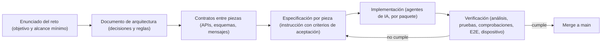

# Especificación de la app y desarrollo guiado por especificaciones (SDD)

Este documento recoge el **contrato de la aplicación** (qué debe hacer y cómo se comprueba, derivado del objetivo del reto) y explica cómo se trabajó: casi sin proponérnoslo, el desarrollo siguió un enfoque **spec-first informal**, cercano al Spec-Driven Development (SDD): primero una especificación con criterios de aceptación, después la implementación, y siempre una verificación contra esa especificación. **El autor validó y probó cada pieza antes de integrarla.** No es SDD estricto, y la sección 6 explica por qué.

## 1. De dónde sale la especificación



## 2. Especificación funcional y trazabilidad

Cada requisito del alcance mínimo se tradujo en afirmaciones verificables. La columna **Verificación** indica con qué se comprueba.

| Requisito del reto | La app debe... | Paquetes | Verificación |
|---|---|---|---|
| **Onboarding y autenticación** | Registrar en tres pasos (acceso con contraseña de al menos 8 caracteres, datos con mayoría de edad, uso de la cuenta); iniciar y cerrar sesión; restaurar la sesión al abrir; leer el segmento que calcula el backend, sin calcularlo ni escribirlo | `feature_onboarding` | Pruebas de validaciones y de los Cubits; E2E; prueba manual con usuarios de los dos segmentos |
| **Cuentas, saldos y movimientos** | Mostrar datos reales con paginación estable; manejar el dinero en **centavos enteros**; derivar el signo del tipo de movimiento; mapear los errores por código; permitir registrar un movimiento rotulado como demostración | `feature_accounts` | Pruebas del parser de montos, de la paginación y del mapeo de errores; prueba de integración contra el backend |
| **Personalización dinámica** | Componer el home según el segmento a partir de un JSON versionado de Remote Config; usar valores por defecto si falla; ignorar bloques desconocidos; actualizarse en vivo; mostrar un resumen de gastos | `feature_personalization` | Pruebas del parser del JSON; cambio en vivo desde la consola en el dispositivo |
| **Servicio externo** | Convertir EUR→USD con datos reales de una API pública; mostrar la fecha de la tasa; reintentar, cachear y recuperarse; calcular con aritmética entera | `feature_exchange` | Pruebas de conversión, de interpretación de la tasa y de caché con cliente simulado |
| **Notificaciones push** | Pedir el permiso (Android 13 o superior); registrar el token; borrar el token **antes** de cerrar sesión; avisar sin importes en el texto; abrir la cuenta al tocar el aviso | `feature_notifications` y backend de apoyo | Pruebas del controlador con falsos; pruebas del backend (disparador, idempotencia, mensaje sin importes); prueba manual en el dispositivo |
| **Monitoreo en producción** | Enviar eventos, errores y trazas a Firebase a través de una interfaz, con un filtro que solo deja pasar una lista cerrada de parámetros y nunca mensajes de error, correos, nombres ni importes; emitir eventos finos (embudo del registro, estados degradados, notificaciones) | `core_telemetry` y los features | Pruebas del filtro de privacidad y de los eventos de cada feature; comprobación en DebugView |
| **Conectividad limitada, latencia, indisponibilidad parcial** | Reintentar con espera creciente; servir datos guardados con su fecha; recuperarse sola; seguir funcionando si cae un servicio mientras el otro responde | `core_network`, `core_storage`, `app` | Pruebas de reintentos y de caché; E2E con modo sin conexión; panel de depuración por servicio |
| **Pruebas** | Tener pruebas unitarias, de widgets y un flujo E2E crítico | todos | `melos run test` en el CI; E2E en dispositivo contra el backend |
| **Documentar el uso de IA** | Explicar herramientas, método, reparto de roles e impacto | documentación | [`ia/uso-de-ia.md`](ia/uso-de-ia.md) |
| **Demostración** | Mostrar todo lo anterior funcionando, incluida la conectividad degradada | documentación | Video, siguiendo el guion de `packages/app/README.md` |

Los criterios transversales (arquitectura, calidad, experiencia de usuario, documentación, versionado) se especificaron como reglas, en la sección 4.

## 3. Contratos: la parte más importante de la especificación

Dos agentes que trabajan en paralelo solo pueden colaborar si lo que se prometen está escrito. Estos son los contratos que se fijaron antes de implementar:

| Contrato | Qué fija |
|---|---|
| **Backend** (`docs/BACKEND_CONTRATO.md`) | Tablas, columnas, funciones remotas (RPC), reglas de seguridad por usuario y errores esperados |
| **API pública de `core_ui`** | Nombres y parámetros de los componentes, el tema y las funciones de formato que consumen los features |
| **API pública de cada feature** | Qué exporta su barril y su función de registro de dependencias; nunca clases de la capa de datos |
| **JSON de personalización** | `schema_version`, lista `default`, lista por segmento, tipos de bloque y parámetros, y qué hacer ante un JSON inválido |
| **Mensaje de push** | Textos por tipo de movimiento (sin importes), claves de `data`, canal de Android y envío a todos los dispositivos del usuario |
| **Telemetría** | Lista cerrada de parámetros permitidos y de nombres de evento |

## 4. Reglas transversales (criterios de aceptación permanentes)

- Un feature nunca depende de otro feature; solo de paquetes `core_*`. Solo el shell los conecta.
- Ningún widget ni Cubit importa `supabase_flutter`; solo la capa de datos toca Supabase.
- El dinero es siempre un entero en centavos; nunca `double`.
- Ningún secreto en el repositorio; solo la clave publicable en la app.
- Ningún dato personal en la telemetría ni en el texto de las notificaciones.
- Pruebas proporcionales: a fondo en lo crítico, sin pruebas de aspecto.
- Trunk Based Development: commits pequeños y frecuentes a `main` desde el inicio; desde el frente de notificaciones, una rama corta por pieza, uno o dos commits, merge sin fast-forward el mismo día y CI en verde antes de continuar.

Estas reglas se comprueban de forma reproducible:

```bash
melos run analyze
melos run test
grep -rn "package:supabase_flutter" packages/features packages/core/core_ui --include="*.dart"
grep -rn "1250.75\|service_role\|anonKey" packages --include="*.dart"
grep -rn "127.0.0.1\|10.0.2.2\|eyJhbGci\|sb_publishable_\|sb_secret_" packages --include="*.dart" --exclude-dir=test --exclude-dir=integration_test
```

Los dos últimos solo deben devolver coincidencias conocidas: valores de ejemplo en pruebas y el mensaje de error de `SupabaseConfig` que sugiere el comando con la URL local.

## 5. Cómo se aplicó el ciclo

1. **Especificar.** Del enunciado y del documento de arquitectura salió una instrucción por pieza, con contexto, reglas, alcance, pruebas exigidas y criterios de aceptación. Cada instrucción es, en la práctica, una especificación ejecutable (`docs/ia/prompts/`).
2. **Implementar.** Un agente de IA por paquete, con propiedad exclusiva de carpetas, escribía el código y las pruebas que la especificación exigía.
3. **Verificar contra la especificación.** El autor validaba y probaba siempre: ejecutaba el análisis, las pruebas y las comprobaciones de la sección 4, probaba en el dispositivo físico y hacía cada commit; el resultado real volvía al agente. Cada pieza se integró tras esa verificación. Una regla prohibía afirmar que algo cumplía sin esa salida.
4. **Corregir la especificación cuando era ella la equivocada.** Varias veces el error estaba en la especificación y no en el código (ver 6).
5. **Integrar.** Solo con la verificación en verde: merge a `main` y CI.

## 6. Qué fue SDD y qué no (con honestidad)

- **No se usó una herramienta específica de SDD** ni se partió de una carpeta de especificaciones formal. Las especificaciones eran el documento de arquitectura, los contratos y las instrucciones por pieza, escritas a medida que avanzaba el proyecto. Por eso decimos que se aplicó de forma informal, casi sin proponérnoslo.
- **El código era la fuente de verdad ante cualquier discrepancia.** En casi todas las instrucciones consta que, si algo no coincide con el texto, manda el código real. En un SDD estricto manda la especificación; aquí fue al revés. Por eso lo llamamos spec-first informal y no SDD estricto.
- **La redacción de las especificaciones fue asistida por IA.** La dirección, las decisiones, el alcance y la validación son del autor; el texto de los contratos y de las instrucciones, igual que el código, se redactó con asistencia de IA y el autor lo revisó, corrigió y aprobó.
- **Lo que sí cumple el enfoque:** el criterio de aceptación se escribía antes de implementar, la implementación se verificaba contra él y las desviaciones se corregían en la especificación.
- **Deriva de la especificación.** Es el riesgo principal que apareció y se documentó: instrucciones que describían un estado ya superado (por ejemplo, una fase dada por pendiente cuando ya estaba integrada), un contrato de backend redactado sin verificar contra la base real, y un documento de arquitectura que quedó atrás del código y se reconcilió al final. La mitigación fue añadir precondiciones verificables a cada instrucción y exigir que el agente lea el código real antes de escribir.
- **La validación fue siempre del autor.** Las especificaciones no se daban por cumplidas porque un agente lo afirmara: se daban por cumplidas cuando el autor ejecutaba las comprobaciones, veía la salida real y probaba el resultado en el dispositivo.
- **Límite de las pruebas con falsos:** no detectan un nombre de columna equivocado en un contrato ni el tipo de un parámetro, por lo que se añadió una prueba de integración contra el backend real (`add_demo_movement` aceptando el monto como cadena decimal).

## 7. Plantilla para especificar una pieza nueva (cómo colaborar)

Cualquier equipo que añada un feature puede seguir la misma plantilla:

1. **Contexto y precondiciones:** qué debe existir ya en `main`, y qué debe leer el implementador antes de escribir.
2. **Propiedad:** qué carpetas son suyas, y qué no puede tocar.
3. **Contrato:** qué consume de otros paquetes y qué expone (su API pública y su función de registro).
4. **Entregables:** qué construye, dividido en piezas pequeñas.
5. **Pruebas exigidas:** lo crítico a fondo; qué se deja sin probar y por qué.
6. **Criterios de aceptación:** los comandos y comprobaciones que demuestran que cumple, incluida la verificación manual.
7. **Flujo de versionado:** rama corta por pieza, uno o dos commits, merge sin fast-forward, CI en verde antes de seguir.
